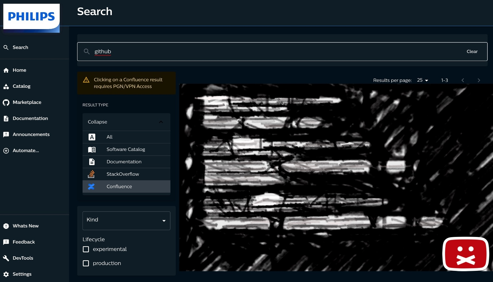

<!--
_backgroundColor: #purple
_color: yellow
-->

<style scoped>
h1 {
  text-align: right;
  font-size: 80px;
  color: blue;
}

h2 {
  font-size: 60;
  text-align: right;
}

em {
  font-weight: bold;
  font-style: normal;
  color: blue;
}

p {
  font-style: italic;
  text-align: right;
}

strong {
    font-weight: bold;
    color: blue;
}
</style>


# InnerSource Odyssey

Building a Developer-Driven Ecosystem

<br>
<br>

## Niek Palm


---


<!--
_backgroundColor: #002C77
_color: white
-->

# How do you picture Philips?


<!--
What are we doing here?
Philips is a worldwide recognisable brand almost everyone in the world has heard of Philips.
But you don't think of software.
How do you picture philips?
-->

---
<!--
_backgroundColor: #00629F
_color: white
-->


# Probably this?

---

# <!-- fit --> Not this


<!--
_backgroundColor: #0072DA
_color: white
-->


---

<!--
_backgroundColor: #0072DA
_color: white
-->

## Philips is a **health technology** company improving people's health and well-being through meaningful innovation

## Our purpose is to improve people’s health and well-being. We aim to improve 2.5 billion lives per year by 2030


---

<!--
_backgroundColor: #0072DA
_color: white
-->

# Software in Philips

- 8000+ software professionals

- Global organisation

- Regulated medical software

- 100s millions lines of code


<!-- 
We build a lot of software in philips
We have a lot of different business units that historically have little alignment
 -->


--- 
<!--
_backgroundColor: red
_color: yellow
-->


# Challenges 🤔 🤔 🤔

- Collaboration
- Manual processes
- Manual maintained
- Manual scaling

---

<!--
_backgroundColor: #D10077
_color: #EABEDB
-->


# What is InnerSource

The sharing of knowledge, skills, documentation, and code inside your organization using open source-style collaboration.


<!-- 

InnerSource is key to our software strategy

In Philips we combine world class tools to enable teams to focus on meaningful innovation to improve people lives.

InnerSource is a development methodology where engineers build proprietary software using best practices from large-scale open source projects.

Teams with generative cultures have 30% higher organizational performance **Source: DORA State of DevOps 2023**

-->


---

<style scoped>
h1 {
  text-align: center;
  position: absolute;
  top: 20px;
  left: 40px;
  font-size: 100px;
  color: black;
  text-shadow: 1px 1px 1px #ffffff;

}
</style>


# 2015 - 2019


---

c
<style scoped>
h1 {
  align: center;
  text-align: center;
  position: absolute;
  top: 20px;
  left: 250px;
  font-size: 100px;
  color: blue;
  /* text-shadow: 1px 1px 1px #ffffff; */

}

h2 {
  align: center;
  text-align: center;
  position: absolute;
  top: 550px;
  left: 450px;
  font-size: 70px;
  color: green;
  /* text-shadow: 1px 1px 1px #ffffff; */

}
</style>

# How to succeed
## 2020 - 2022


---


<!--
_backgroundColor: #D10077
_color: #EABEDB
-->

# Enable InnerSource

- One source code platform

- InnerSource as default

- Collaborate at scale

<!-- 

NOTES 

-->

---


<!--
_backgroundColor: #D10077
_color: #EABEDB
-->

# Automation as a habit

- CI/CD a First-class citizen

- As easy as for Open Source

- But with enterprise needs

<!-- 

NOTES 

-->


---

<!--
_backgroundColor: #269A91
_color: #244C5D
-->

## <!-- fit --> But how can we connect
## <!-- fit --> to our network?


---


<!--
_backgroundColor: #269A91
_color: #244C5D
-->

## <!-- fit --> ~~hosted runners~~
## <!-- fit --> self-hosted runners


---
<!--
_backgroundColor: #269A91
_color: #244C5D
-->

## <!-- fit --> Why self-hosted?


---

<!--
_backgroundColor: #000000
_color: #93C2F8
-->


# <!-- fit --> How to bring same DevX to self-hosted runners? 


---

<!--
_backgroundColor: #D10077
_color: #93C2F8
-->

<!--
_backgroundColor: #008540
_color: #144835
-->

# <!-- fit --> Manual?


<!-- 

- Scale?

- Sustainable?

- Maintenance?

-->


---

<!--
_backgroundColor: #D10077
_color: #93C2F8
-->

<!--
_backgroundColor: #008540
_color: #144835
-->

# <!-- fit --> Ask AI?


<!-- 


-->


---

<!--
_backgroundColor: #000000
_color: #93C2F8
-->

# <!-- fit --> 💡 Scalable self-hosted 💡


<!-- 
---

<!--
_backgroundColor: #269A91
_color: #244C5D
-->

<style scoped>
section {
  font-size: 28px;
}
</style>


---
<!--
_backgroundColor: #269A91
_color: #244C5D
_footer: ''
-->

# Open Source

✨ ARM | Windows | GHES | Security

⭐ 2.2K stars / 140+ Contributors

🏆 ThoughtWorks Radar Tools Assess


<!-- 

topics we could cover

- PR checks automated
- Automated release
- Slack
- Build a community

# Contribution

- Support windows
- Support ARM
- Support GHES
- Better docs
- Security improvements
- Upgrades

 -->


---


<style scoped>
h1 {
  text-align: center;
  padding-top: 5.1em;
  /* align text at the bottom */
  font-size: 120px;
  bottom: 9;
  color: white;
  text-shadow: 2px 2px 4px #000000;
}


strong {
    font-weight: bold;
    color: green;
}
</style>


# Running at Scale

---
<!--
_backgroundColor: #000000
-->


<video src="assets/runners.webm" controls width="100%"></video>

---
<!--
_backgroundColor: tomato
_color: white
-->

<style scoped>
h1 {
  text-align: center;
  /* padding-top: 5.1em; */
  /* align text at the bottom */
  /* font-size: 120px; */
  /* bottom: 9; */
  color: yellow;
  /* text-shadow: 2px 2px 4px #000000; */
}


strong {
    font-weight: bold;
    color: green;
}
</style>


# <!-- fit --> Self Service 🤔 🤔 🤔

- How to onboard to GitHub?
- How to get access to Ci/CD?
- How to become admin?


---


<!--
_backgroundColor:  #002C77
_color: #93C2F8
-->

# <!-- fit --> 🚀💨 
# <!-- fit --> IssueOps


<!--

-->


---


<!--
_backgroundColor:  #002C77
_color: #93C2F8
_footer: ''
-->

# <!-- fit --> 🚀💨 
# <!-- fit --> IssueOps


<!--

-->


---


<!--
_backgroundColor: darkpurple
_color: lightgreen
-->
<style scoped>
h1 {
  color: lightgreen
  /* text-align: center; */
  /* padding-top: 5.1em; */
  /* align text at the bottom */
  /* font-size: 120px; */
  /* bottom: 9; */
  /* color: white; */
  /* text-shadow: 2px 2px 4px #000000; */
}

strong {
    font-weight: normal;
    color: seagreen;
}
/* section {
  font-size: 45px;
} */

section img {
   background-color: #191a1a
}

</style>


# <!-- fit --> 🤖 Compliance - addressing problems


- **bot** Continuous running rule sets with GitHub actions 
- **powered by** Repo Linter from the TODO group 


<!--
(https://github.com/todogroup/repolinter)

-->

---

<!--
_backgroundColor: darkpurple
_color: lightgreen

-->
<style scoped>
h1 {
  color: lightgreen
  /* text-align: center; */
  /* padding-top: 5.1em; */
  /* align text at the bottom */
  /* font-size: 120px; */
  /* bottom: 9; */
  /* color: white; */
  /* text-shadow: 2px 2px 4px #000000; */
}

strong {
    font-weight: normal;
    color: seagreen;
}
/* section {
  font-size: 45px;
} */


section img {
   background-color: darkpurple
}

</style>


# <!-- fit --> 📖 Compliance - guide

- **event based** data pipe consuming GitHub events
- **app** welcome lambda creating guidance issue


---

<!--
_color: darkblue
-->
<style scoped>
h1 {
  /* text-align: center; */
  /* padding-top: 5.1em; */
  /* align text at the bottom */
  /* font-size: 120px; */
  /* bottom: 9; */
  /* color: white; */
  /* text-shadow: 2px 2px 4px #000000; */
}

section img {
   background-color: rgba(255,255,255,0)urple
   loat: right
}

</style>


# <!-- fit --> 🙋 Ask Philips Community


---


<style scoped>
h1 {
  text-align: center;
  position: absolute;
  top: 20px;
  left: 40px;
  font-size: 100px;
  color: red;
  text-shadow: 2px 2px 4px #ffffff;
}
</style>


# Silos version 2.0


---


# Lessons learned


---

<!--
_backgroundColor: #110d0d
_color: #0072DA
-->

<style scoped>
h2 {
  text-align: center;
  position: absolute;
  top: 20px;
  left: 40px;
  font-size: 50px;
  color: lightgreen;
}
</style>


# <!-- fit --> 🚀 Developer Experience 🚀

## 2022 - present

* Productivity - Am I enabled?
* Impact - Can I focus on my job?
* Statisfaction - Do I have the right environment?


---


<!--
_backgroundColor: #110d0d
_color: #0072DA
-->

# <!-- fit --> Developer Portal

> Build an ecosystem, not a wilderness

- Software Catalogus
- Bootstrap / Scaffolding
- TechDocs


---

<!--
_backgroundColor: #000000
_color: #0072DA
-->

# 📙 Software Catalogus


---

<!--
_backgroundColor: #000000
_color: #0072DA
-->

# 📙 Software Catalogus




---


<!--
_backgroundColor: #000000
_color: #0072DA
-->

# ⛭ Scaffolding / Automation


---

<!--
_backgroundColor: #000000
_color: #0072DA
-->

# 🚀 Example component - GitHub runners


---


<!--
_backgroundColor: #000000
_color: #0072DA
-->

# 📚 TechDocs


---


<!--
_backgroundColor: #000000
_color: #0072DA
-->

# 🤖 Compliance - software quality


---

<!--
_backgroundColor: #000000
_color: #0072DA
-->

# 🚀 Enable via configuration

- Define software assets as code (catalog file)
- Enable plugins via annotation
- Default integrations enabled
- No extra development effort required


---

<!--
_backgroundColor: #000000
_color: #0072DA
-->

# ✨ Contribution

- Open for extension via InnerSource
- Developer guide for extension
- Enable via DevContainers / CodeSpaces
- Hackathons to promote and learn


---

<!--
_backgroundColor: white
_color: #0072DA
-->


# <!-- fit --> :rocket: also serverless

- ALB to enforce SSO login
- Fargate to serve Backstage 
- OpenSearch to speed up searches
- S3 to serve TechDocs

---


<!--
_backgroundColor: DeepPink
_color: Lavender
-->
<style scoped>

strong {
    font-weight: normal;
    color: Plum;
}
/* section {
  font-size: 45px;
} */

/* section img {
   background-color: #191a1a
} */

</style>


# <!-- fit --> 🚀 Lagacy meets IDP

- **IssueOps** -> Automation templates (skafolder)
- **Compliance** -> Views in IDP
- **Ask** -> Search via IDP / Component IDP
- **Status** -> Component in IDP
- **Events** -> Refresh components / update systems


---


<!--
_backgroundColor: DeepPink
_color: Lavender
-->
<style scoped>

strong {
    font-weight: normal;
    color: Plum;
}
/* section {
  font-size: 45px;
} */

/* section img {
   background-color: #191a1a
} */

</style>

# Where are we now

<style scoped>
section {
  font-size: 45px;
}
</style>

🧑‍💻 **5.5K+** developers

🗃️ **14K+** repositories

🚀 **30K+** jobs / day


---

<!--
_backgroundColor: black
_footer: ''

-->


<style scoped>
h1 {
  font-size: 50px; 
}


</style>

# 🔗 Resources

```hcl
# slides, links e.g.
resource "website" "links" {
  url = "https://npalm.github.io/2024-03-18-devopsdays-krakow"
}

resource "contact" "niek" {
  github   = "@npalm"
  linkedin = "in/niekpalm/"
  twitter  = "@niekos77"
}
```


---

# Questions

<style scoped>
h1 {
  font-size: 120px;
}
</style>


---


<!--
_backgroundColor: #D10077
_color: purple
-->

# <!-- fit --> Thank You
<br>
<br>
<br>


