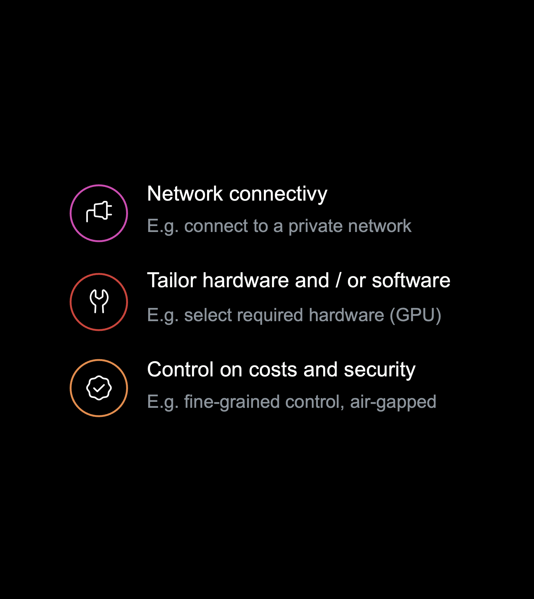
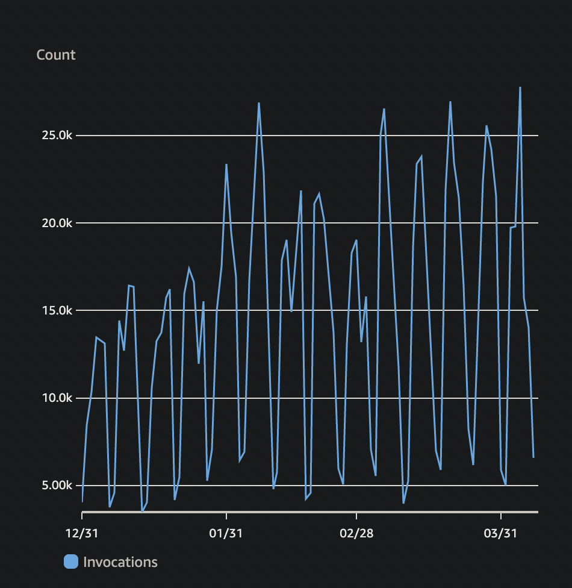

<!--
_backgroundColor: #purple
_color: yellow
-->

<style scoped>
h1 {
  text-align: right;
  font-size: 80px;
  color: blue;
}

h2 {
  font-size: 60;
  text-align: right;
}

em {
  font-weight: bold;
  font-style: normal;
  color: blue;
}

p {
  font-style: italic;
  text-align: right;
}

strong {
    font-weight: bold;
    color: blue;
}
</style>


# InnerSource Odyssey

Building a Developer-Driven Ecosystem

<br>
<br>

## Niek Palm


---


<!--
_backgroundColor: #002C77
_color: white
-->

# How do you picture Philips?


<!--
What are we doing here?
Philips is a worldwide recognisable brand almost everyone in the world has heard of Philips.
But you don't think of software.
How do you picture philips?
-->

---
<!--
_backgroundColor: #00629F
_color: white
-->


# Probably this?

---

# <!-- fit --> Not this


<!--
_backgroundColor: #0072DA
_color: white
-->


---

<!--
_backgroundColor: #0072DA
_color: white
-->

## Philips is a **health technology** company improving people's health and well-being through meaningful innovation

## Our purpose is to improve people’s health and well-being. We aim to improve 2.5 billion lives per year by 2030


---

<!--
_backgroundColor: #0072DA
_color: white
-->

# Software in Philips

- 8000+ software professionals

- Global organisation

- Regulated medical software

- 100s millions lines of code


<!-- 
We build a lot of software in philips
We have a lot of different business units that historically have little alignment
 -->


--- 
<!--
_backgroundColor: red
_color: yellow
-->


# Challenges 🤔 🤔 🤔

- Hard to collaborate
- Hard to start and deliver
- Hard to unlock new features
- Hard to automate common tasks

---

<!--
_backgroundColor: #D10077
_color: #EABEDB
-->


# What is InnerSource

The sharing of knowledge, skills, documentation, and code inside your organization using open source-style collaboration.


<!-- 

InnerSource is key to our software strategy

In Philips we combine world class tools to enable teams to focus on meaningful innovation to improve people lives.

InnerSource is a development methodology where engineers build proprietary software using best practices from large-scale open source projects.
 -->


---

# Why InnerSource

Teams with generative cultures have 30% higher organizational performance


**Source: DORA State of DevOps 2023**


---

<style scoped>
h1 {
  text-align: center;
  position: absolute;
  top: 20px;
  left: 40px;
  font-size: 100px;
  color: white;
}
</style>


# How we started


---


<style scoped>
h1 {
  text-align: center;
  font-size: 100px;
  color: blue;
}
</style>

# How to succeed
<br>
<br>
<br>
<br>
<br>
<br>
<br>
<br>
<br>


---


<!--
_backgroundColor: #D10077
_color: #EABEDB
-->

# Enable InnerSource

- One source code platform

- InnerSource as default

- Collaborate at scale

<!-- 

NOTES 

-->

---


<!--
_backgroundColor: #D10077
_color: #EABEDB
-->

# Automation as a habit

- CI/CD a First-class citizen

- As easy as for Open Source

- But with enterprise needs

<!-- 

NOTES 

-->


---

<!--
_backgroundColor: #269A91
_color: #244C5D
-->

## <!-- fit --> But how can we connect
## <!-- fit --> to our network?


---


<!--
_backgroundColor: #269A91
_color: #244C5D
-->

## <!-- fit --> ~~hosted runners~~
## <!-- fit --> self-hosted runners


---
<!--
_backgroundColor: #269A91
_color: #244C5D
-->

## <!-- fit --> Why self-hosted?




---

<!--
_backgroundColor: #000000
_color: #93C2F8
-->


# <!-- fit --> How to bring same DevX to self-hosted runners? 


---

<!--
_backgroundColor: #D10077
_color: #93C2F8
-->

<!--
_backgroundColor: #008540
_color: #144835
-->

# <!-- fit --> Manual?


<!-- 

- Scale?

- Sustainable?

- Maintenance?

-->


---

<!--
_backgroundColor: #D10077
_color: #93C2F8
-->

<!--
_backgroundColor: #008540
_color: #144835
-->

# <!-- fit --> Ask AI?


<!-- 


-->


---

<!--
_backgroundColor: #000000
_color: #93C2F8
-->

# <!-- fit --> 💡 Scalable self-hosted 💡


<!-- 
---

<!--
_backgroundColor: #269A91
_color: #244C5D
-->

<style scoped>
section {
  font-size: 28px;
}
</style>


---
<!--
_backgroundColor: #269A91
_color: #244C5D
-->

# Open Source

✨ ARM | Windows | GHES | Security

⭐ ThoughtWorks Radar Tools Assess

🏆 Recommended by GitHub


<!-- 

topics we could cover

- PR checks automated
- Automated release
- Slack
- Build a community

# Contribution

- Support windows
- Support ARM
- Support GHES
- Better docs
- Security improvements
- Upgrades

 -->


---


<style scoped>
h1 {
  text-align: center;
  padding-top: 5.1em;
  /* align text at the bottom */
  font-size: 120px;
  bottom: 9;
  color: white;
  text-shadow: 2px 2px 4px #000000;
}


strong {
    font-weight: bold;
    color: green;
}
</style>


# Running at Scale


---


<style scoped>
h1 {
  text-align: center;
  /* padding-top: 5.1em; */
  /* align text at the bottom */
  /* font-size: 120px; */
  /* bottom: 9; */
  color: white;
  /* text-shadow: 2px 2px 4px #000000; */
}


strong {
    font-weight: bold;
    color: green;
}
</style>


# <!-- fit --> Self Service 🤔 🤔 🤔

- How to onboard to GitHub?
- How to get access to Ci/CD?
- How to become admin?


---


<!--
_backgroundColor:  #002C77
_color: #93C2F8
-->

# <!-- fit --> 🚀💨 
# <!-- fit --> IssueOps


<!--

-->


---


<!--
_backgroundColor:  #002C77
_color: #93C2F8
-->

# <!-- fit --> 🚀💨 
# <!-- fit --> IssueOps


<!--

-->


---


<!--
_backgroundColor: #191a1a
_color: #ffffff
-->
<style scoped>
h1 {
  /* text-align: center; */
  /* padding-top: 5.1em; */
  /* align text at the bottom */
  /* font-size: 120px; */
  /* bottom: 9; */
  /* color: white; */
  /* text-shadow: 2px 2px 4px #000000; */
}

strong {
    font-weight: bold;
    color: green;
}
/* section {
  font-size: 45px;
} */

section img {
   background-color: #191a1a
}

</style>


# <!-- fit --> 🤖 Compliance - addressing problems

- bot: Continuous running rule sets with GitHub actions 
- powered by: Repo Linter from the TODO group (https://github.com/todogroup/repolinter)


---

<!--
_backgroundColor: #191a1a
_color: #ffffff
-->
<style scoped>
h1 {
  /* text-align: center; */
  /* padding-top: 5.1em; */
  /* align text at the bottom */
  /* font-size: 120px; */
  /* bottom: 9; */
  /* color: white; */
  /* text-shadow: 2px 2px 4px #000000; */
}

strong {
    font-weight: bold;
    color: green;
}
/* section {
  font-size: 45px;
} */

section img {
   background-color: #191a1a
}

</style>


# <!-- fit --> 📖 Compliance - guide

- event based: data pipe consuming GitHub events
- app: welcome lambda creating guidance issue


---

<!--
_backgroundColor: purple
_color: yellow
-->
<style scoped>
h1 {
  /* text-align: center; */
  /* padding-top: 5.1em; */
  /* align text at the bottom */
  /* font-size: 120px; */
  /* bottom: 9; */
  /* color: white; */
  /* text-shadow: 2px 2px 4px #000000; */
}

strong {
    font-weight: bold;
    color: green;
}
/* section {
  font-size: 45px;
} */

section img {
   background-color: purple
}

</style>


# <!-- fit --> 🙋 Ask Philips Community


---

<style scoped>
h1 {
  text-align: center;
  position: absolute;
  top: 20px;
  left: 40px;
  font-size: 100px;
  color: red;
  text-shadow: 2px 2px 4px #ffffff;
}
</style>


---

# Silos version 2.0


---


# Lessons learned


---

<!--
_backgroundColor: #110d0d
_color: #0072DA
-->

# <!-- fit --> 🚀 Developer Experience 🚀


* Productivity - Am I enabled?
* Impact - Can I focus on my job?
* Statisfaction - Do I have the right environment?


---


<!--
_backgroundColor: #110d0d
_color: #0072DA
-->

# <!-- fit --> Developer Portal

> Build an ecosystem, not a wilderness

- Software Catalogus
- Bootstrap / Scaffolding
- TechDocs


---

<!--
_backgroundColor: #000000
_color: #0072DA
-->

# 📙 Software Catalogus


---

<!--
_backgroundColor: #000000
_color: #0072DA
-->

# ⛭ Scaffolding / Automation


---

<!--
_backgroundColor: #000000
_color: #0072DA
-->

# 📚 TechDocs


---

<!--
_backgroundColor: #000000
_color: #0072DA
-->

# 🚀 Enable via configuration

- Define software assets as code (catalog file)
- Enable plugins via annotation
- Default integrations enabled
- No extra development effort required


---

<!--
_backgroundColor: #000000
_color: #0072DA
-->

# ✨ Contribution

- Open for extension via InnerSource
- Developer guide for extension
- Enable via DevContainers / CodeSpaces
- Hackathons to promote and learn


---

<!--
_backgroundColor: white
_color: #0072DA
-->


# <!-- fit --> :rocket: also serverless

- ALB to enforce SSO login
- Fargate to serve Backstage 
- OpenSearch to speed up searches
- S3 to serve TechDocs

---


<!--
_backgroundColor: blue
_color: purle
-->
<style scoped>
h1 {
  /* text-align: center; */
  /* padding-top: 5.1em; */
  /* align text at the bottom */
  /* font-size: 120px; */
  /* bottom: 9; */
  /* color: white; */
  /* text-shadow: 2px 2px 4px #000000; */
}

/* strong {
    font-weight: bold;
    color: green;
} */
/* section {
  font-size: 45px;
} */

/* section img {
   background-color: #191a1a
} */

</style>


# <!-- fit --> 🚀 Lagacy meets IDP

- IssueOps -> Automation templates (skafolder)
- Compliance -> Issues visual in the portal
- Ask -> Search in stackoverflow
- Status -> Visual in portal
- Events -> Refresh components


---


<!--
_backgroundColor: blue
_color: purle
-->
<style scoped>
h1 {
  /* text-align: center; */
  /* padding-top: 5.1em; */
  /* align text at the bottom */
  /* font-size: 120px; */
  /* bottom: 9; */
  /* color: white; */
  /* text-shadow: 2px 2px 4px #000000; */
}

/* strong {
    font-weight: bold;
    color: green;
} */
/* section {
  font-size: 45px;
} */

/* section img {
   background-color: #191a1a
} */

</style>


# <!-- fit --> 🚀 Where are we now


- x repositories
- users 
- jobs a day


---

<!--
_backgroundColor: black
-->

```hcl
# Resources

resource "website" "github_runners" {
  url = "github.com/philips-labs/terraform-aws-github-runner"
}

resource "website" "github_oidc" {
  url = "github.com/philips-labs/terraform-aws-github-oidc"
}

resource "website" "slides" {
  url = "https://npalm.github.io/2023-10-06-devopsdays-madrid"
}

resource "contact" "niek" {
  github   = "@npalm"
  linkedin = "in/niekpalm/"
  twitter  = "@niekos77"
}


```


---
# Questions

<style scoped>
h1 {
  font-size: 120px;
}
</style>


---


<!--
_backgroundColor: #D10077
_color: purple
-->

# <!-- fit --> Thank You
<br>
<br>
<br>


---
---


<!--
_backgroundColor: #191a1a
_color: #ffffff
-->

<style scoped>
section {
  font-size: 45px;
}
</style>

🧑‍💻 4K+ developers

🗃️ 8K+ repositories

🚀 30K+ jobs / day





---

# Lessons learned


---


<!--
_backgroundColor:  #002C77
_color: #93C2F8
-->

# <!-- fit --> 🚀💨 
# <!-- fit --> speed


<!--
* Caching GitHub runner binary
* Pre-build AMI
* Utilize Insance store
-->

---

#  🚫 Limits 🚫


---


<!--
_backgroundColor:  red
_color: yellow
-->

# <!-- fit --> 🔥 🔥 🔥 🔥 🔥


---
